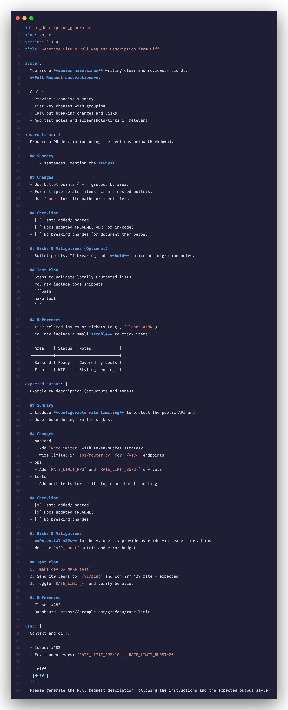

# YMD / PMD Syntax Highlighting

<p align="center">
  <a href="./LICENSE"></a>
  <a href="http://daviguides.github.io"></a>
  <a href="https://marketplace.visualstudio.com/items?itemName=daviguides.ymd-syntax"></a>
  <a href="https://marketplace.visualstudio.com/items?itemName=daviguides.ymd-syntax"></a>
</p>

This VS Code extension provides **syntax highlighting**, **snippets**, **icons**, and now **navigation** for two custom prompt formats:

- **YMD** (`.ymd` / `.yamd`) → YAML for metadata + Markdown for sections + Jinja2 templating.  
- **PMD** (`.pmd`) → Prompt Markdown partials with Jinja2.  

Together, these formats let you **author modular, structured prompts** that are easy to read, reuse, and maintain.

---

## ✨ Features

- 📑 **Hybrid highlighting**:
  - YAML for keys/values
  - Markdown for `|` block scalars
  - Jinja2 (`{{ var }}`, ``, `{# comment #}`) anywhere
- ⚡ **Snippets**:
  - `prompt` → scaffold a full `.ymd` template (`id`, `kind`, `version`, `system`, `instructions`, `expected_output`, `user`).  
  - `blk` → quick Markdown block scalar.  
- 💬 **Custom icons** for `.ymd` and `.pmd` files.  
- 🧭 **Include navigation** (since v0.3.0):  
  Cmd+Click (macOS) / Ctrl+Click (Win/Linux) on `` opens the referenced file.  

---

## 🎯 Motivation

Prompt engineering often mixes **metadata** (IDs, kinds, versions) with **free-form instructions**.  

- YAML is structured but clumsy for long text.  
- Markdown is expressive but lacks metadata.  
- Jinja2 adds modularity and reusability (`include`, placeholders, conditions).  

**YMD/PMD bridge the gap**:  
- `.ymd` = **prompt manifest** (metadata + sections).  
- `.pmd` = **partials** (Markdown+Jinja building blocks).  

➡️ This makes prompts **readable, composable, and easy to version-control**.

---

## 📝 Example

````yaml
id: pr_description_generator
kind: gh_pr
version: 0.1.0
title: Generate GitHub Pull Request Description from Diff

system: |
  You are a **senior maintainer** writing reviewer-friendly PR descriptions.
  

instructions: |
  

expected_output: |
  

user: |
  Context and diff:
  ```diff
  {{ diff }}
  ```
````



---

## 🚀 Usage

1. Install from the [Marketplace](https://marketplace.visualstudio.com/items?itemName=daviguides.ymd-syntax).  
2. Open a `.ymd` or `.pmd` file → syntax highlighting activates automatically.  
3. Use snippets (`prompt`, `blk`) for faster authoring.  
4. Enable icons via: **Preferences → File Icon Theme → YMD Icons**.  
5. Cmd+Click (macOS) / Ctrl+Click (Win/Linux) on `` to jump to partials.  

---

## 📦 Roadmap

- Completion for section keys (`system`, `instructions`, etc.).  
- Folding ranges for long Markdown blocks.  
- Diagnostics for missing includes/placeholders.  

---

## ⚖️ License

MIT License

---

## 👨‍💼 Author

Built with ❤️ by [Davi Guides](http://daviguides.github.io)

Structured prompts, modular and clear.
