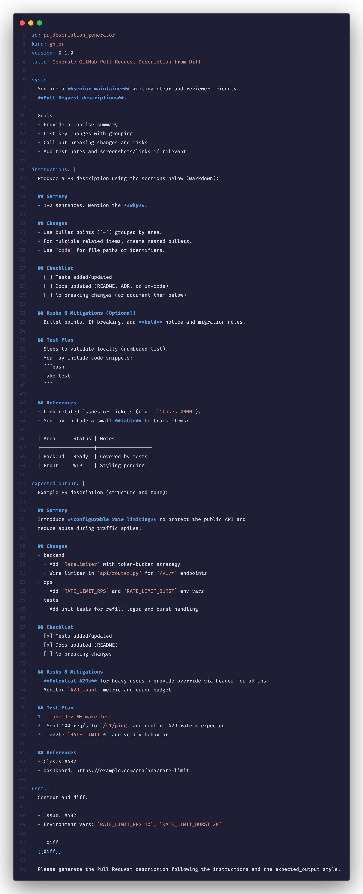

# YMD Syntax Highlighting

  
  
  
  

**YMD** (`.ymd` / `.yamd`) is a custom format for organizing **prompts**:  
- **YAML** provides metadata and structure.  
- **Markdown** lives inside block scalars (`key: |`) for rich prompt text.  

This VS Code extension brings **syntax highlighting**, **snippets**, and a **custom icon** to make `.ymd` prompts easy to read and maintain.

## ✨ Features

- 📑 **Hybrid highlighting**: YAML keys/values + embedded Markdown in block scalars.  
- ⚡ **Snippets**:
  - `prompt` → scaffold a complete prompt template (`id`, `kind`, `version`, `system`, `instructions`, `developer`, `user`).  
  - `blk` → insert a Markdown block scalar quickly.  
- 💬 **Custom file icon**: A speech bubble with `>` and `==` inside, over a purple rounded square — representing a prompt with text.  

## 🎯 Motivation

Prompts often combine **structured metadata** with **free-form instructions**.  
But neither YAML nor Markdown alone is ideal:  

- YAML is structured but unwieldy for long text.  
- Markdown is expressive but lacks metadata organization.  

**YMD bridges this gap**:  
- Use YAML for IDs, kinds, versions, metadata.  
- Use Markdown for system/instructions/developer/user sections.  

➡️ This makes prompts **easier to read, share, and version-control**.

## 📝 Example

## 🚀 Usage

1. Open a `.ymd` file in VS Code.  
2. Syntax highlighting activates automatically.  
3. Use snippets (`prompt`, `blk`) for faster authoring.  
4. Enable the custom icon via:  
   **Preferences → File Icon Theme → YMD Icons**.

## ⚖️ License

MIT License

## 👨‍💼 Author

Built with ❤️ by [Davi Guides](http://daviguides.github.io)

Write structured prompts with clarity.
